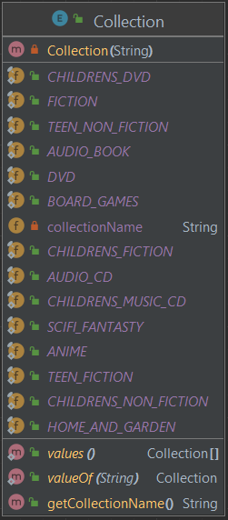
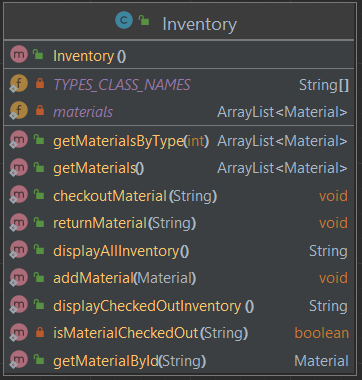
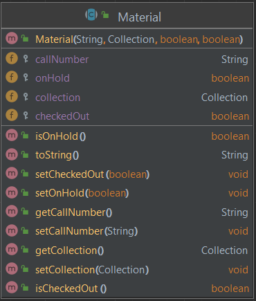
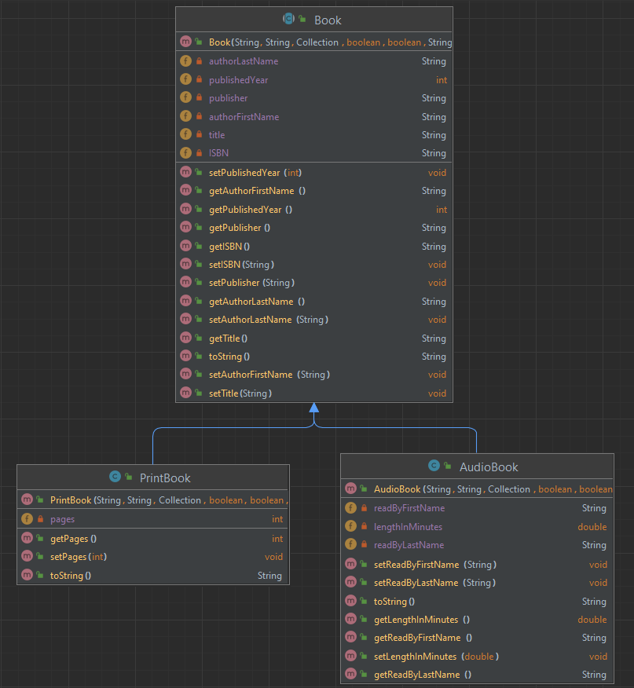
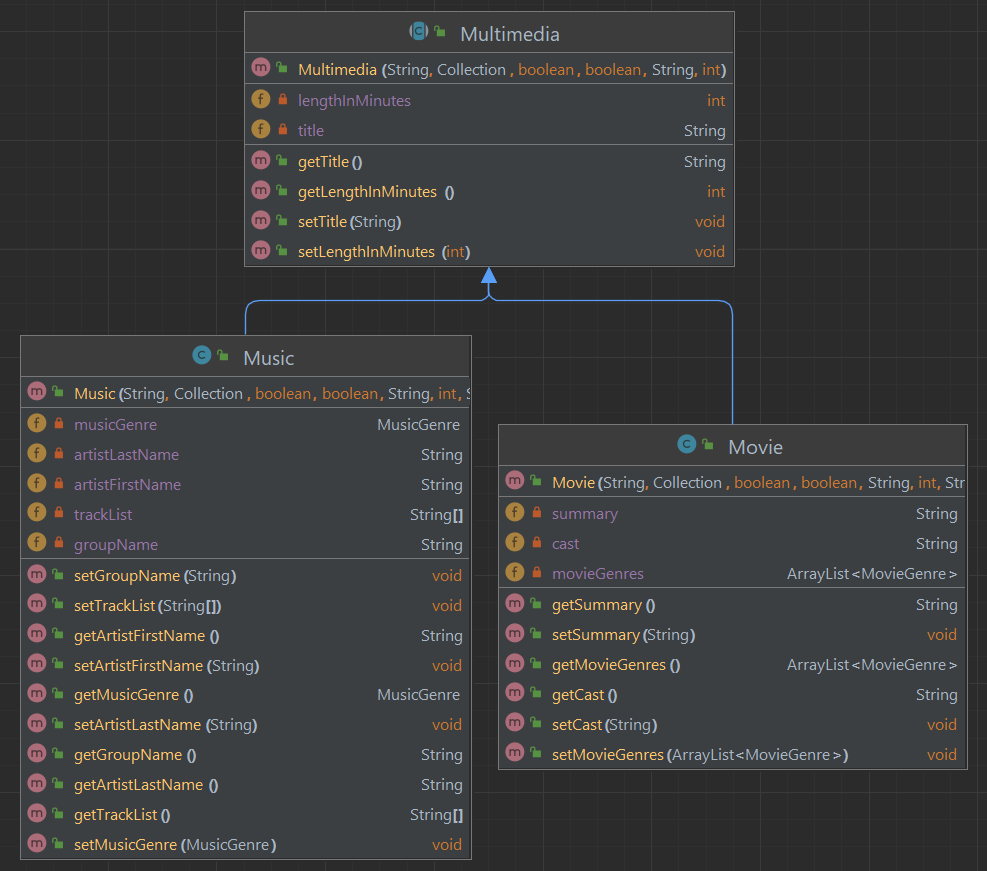
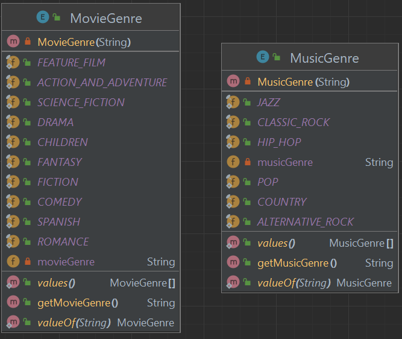

# Library Project

In this project you will practice inheritance, creating and using enums, and creating and using custom exceptions. You will also use previous topics such as serialization, java docs and unit testing.

This program will provide a booking system for users to book a trip with the Travel Oasis travel agency. Users can create trips, add an agent for the trip and trip details, and add multiple guests per trip. They can even go back and edit an existing trip.

Trips are saved when the program closes, so that when the program boots back up all the previously created trips are still in the system.

## Project Instructions

[Follow the general instructions here for forking, cloning, and turning in assignment](https://ihccjavaii.github.io/docs/general-project-instructions/README.md)

You will have sixteen files total in this project:

       - Library (main)
       - Material (super class)
         - Book (sub class, super class)
            - AudioBook (sub class)
            - PrintBook (sub class)
         - Multimedia (sub class, super class)
            - Movie (sub class)
            - Music (sub class)
         - MovieGenre (Enum)
         - MusicGenre (Enum)
         - Collection (Enum)
         - Inventory
         - InvalidMaterialTypeException
         - ItemNotAvailableException
         - InventoryTests
         - LibraryTests


### Collection Enum
    1. Create an enum called Collection that includes at least five types of collections that a library material could be in

Example class diagram. You get to choose your own collection enums.


### Inventory class
    1. Inventory will keep track of all the materials in the library and their status
    2. Make sure that the methods and ArrayList of materials are static, so they can be accessed without instantiating an Inventory object
    3. Create all the fields and methods shown in the example class diagram below 



### Material class
    1. This will be the highest level super class for all the material in the library
    2. It should be declared abstract
    3. Create all the fields and methods shown in the example class diagram below 



### Book, PrintBook, and AudioBook classes
    1. `Book` should extend `Materials` and also be declared abstract
    2. `PrintBook` and `AudioBook` are instantiable (not abstract), and extend `Book` 
    3. Create all the fields and methods shown in the example class diagram below 



### Multimedia, Music and Movie classes
    1. `Multimedia` should extend `Materials` and also be declared abstract
    2. `Music` and `Movie` are instantiable (not abstract), and extend `Multimedia` 
    3. Create all the fields and methods shown in the example class diagram below 



### MovieGenre and MusicGenre

    1. Create enums for `MovieGenre` and `MusicGenre`. You get to choose your own genres. See the images below for some examples.



### Custom exceptions
    1. Create two custom exceptions called `InvalidMaterialTypeException` and `ItemNotAvailableException`
    2. Throw the `InvalidMaterialTypeException` when a patron tries to search for material by an invalid type.
    3. Throw the `ItemNotAvailableException` when no items are found for any type of search

### Library class
This will be the main class that runs the program. You will need to build:

1. A menu system that prompts the user if they want to:
   - See all materials in the catalog (displays all)
   - Look up material by call number (displays one item, if it matches call number, throws exception to display message if not found)
   - Look up material by type (displays all items under one type. If type is not found or invalid, throws exception and displays message)
   - Check out material by call number (sets checkedOut to true on item with call number. If item not found or already checked out, throw exception and display message)
   - Return material by call number (sets checkedOut to false on item with call number. If item not found or NOT checked out, throw exception and display message)
   - See all checked out material (displays only items where checkedOut is true)
2. Break out code into methods. The core logic should happen in the Inventory methods.


### Javadocs
    1. Add Javadoc comments to all classes (ignore get/set/toString. Add only for logic methods and class headers.)

### Unit Testing
    1. Create unit test classes for the `Inventory` and `Library` classes. Aim for at least 90% test coverage of those classes.

[A reminder of how to setup JUnit is here](https://ihccjavaii.github.io/docs/junit/junit-setup-instructions.html)

### Example output

Here's an example of the program running. It does not show all the options, and you do not need to use the same wording for prompts. Use this as a general idea of how the program will run.

```
Welcome to the library! How may I assist you?

Select an option: 
1 - See all material in catalog
2 - Look up material by call number
3 - Look up material by type
4 - Check out material by call number
5 - Return material by call number
6 - See all checked out material
X to exit

3

Select the type of material:
1 - Audio book
2 - Book
3 - Movie
4 - Music

1

Call number: W6L36
Collection: Audio Book
Checked out: No
On hold: No
Title: Tale of Two Cities
Author: Bob, Billy
ISBN: 
Minutes: 236.0
Read by: Borbsky, Timothy

Call number: W6L36
Collection: Audio Book
Checked out: No
On hold: No
Title: Atomic Habits
Author: Clear, James
ISBN: 9781524779276
Minutes: 318.0
Read by: Clear, James

Call number: [Fic]
Collection: Audio Book
Checked out: No
On hold: No
Title: Twilight
Author: Meyer, Stephanie
ISBN: 0307282961
Minutes: 771.0
Read by: Kadushin, Ilyana

Select an option: 
1 - See all material in catalog
2 - Look up material by call number
3 - Look up material by type
4 - Check out material by call number
5 - Return material by call number
6 - See all checked out material
X to exit

4

Enter the call number of the item you wish to checkout:

W6L36

Checked out!

Select an option: 
1 - See all material in catalog
2 - Look up material by call number
3 - Look up material by type
4 - Check out material by call number
5 - Return material by call number
6 - See all checked out material
X to exit

6

Call number: W6L36
Collection: Audio Book
Checked out: Yes
On hold: No
Title: Tale of Two Cities
Author: Bob, Billy
ISBN: 
Minutes: 236.0
Read by: Borbsky, Timothy

Select an option: 
1 - See all material in catalog
2 - Look up material by call number
3 - Look up material by type
4 - Check out material by call number
5 - Return material by call number
6 - See all checked out material
X to exit

5

Enter the call number of the item you wish to return:

W6L36

Item returned!

Select an option: 
1 - See all material in catalog
2 - Look up material by call number
3 - Look up material by type
4 - Check out material by call number
5 - Return material by call number
6 - See all checked out material
X to exit

6

No items checked out.

Select an option: 
1 - See all material in catalog
2 - Look up material by call number
3 - Look up material by type
4 - Check out material by call number
5 - Return material by call number
6 - See all checked out material
X to exit

x
```

### Rubric

Projects are graded on functionality (does it compile, can the user do what they are supposed to, and do they get the expected results). It is also graded on features added in the instructions, like including the correct methods, constructors, data conversions, and tests.

| Topic                                           | Task                                                                                                                                                 | Points |
|-------------------------------------------------|------------------------------------------------------------------------------------------------------------------------------------------------------|--------|
| **Collection, MovieGenre and MusicGenre Enums** | Classes are created as Enums and include correct data                                                                                                | 15     |
|                                                 | Classes are not an enum and/or not working correctly and/or incomplete                                                                               | 5      |
|                                                 | Enums are missing                                                                                                                                    | 0      |
| **Class hierarchy**                             | Class hierarchy is setup correctly according to the instructions, with the correct super classes and sub classes. Super classes are marked abstract. | 25     |
|                                                 | Class hierarchy is missing layers/supers/abstract                                                                                                    | 10     |
|                                                 | Inheritance / class hierarchy not being used                                                                                                         | 0      |
| **Inventory Class**                             | Inventory class is static and maintains record of materials. Functions are included to lookup material by various keys.                              | 25     |
|                                                 | Inventory class is included, but does not maintain record correctly or missing functions.                                                            | 15     |
|                                                 | Does not compile or missing most functionalities.                                                                                                    | 0      |
| **Custom Exceptions**                           | The two custom exceptions are created that extend an existing Java exception. Exceptions are thrown in appropriate areas inside the program.         | 10     |
|                                                 | Less than three exceptions created or exceptions incorrectly created and used                                                                        | 5      |
|                                                 | Custom exceptions missing                                                                                                                            | 0      |
| **Search and Modify Functionality**             | Program allows user to perform various search and modify functions as outlined in instructions.                                                      | 10     |
|                                                 | Includes only some of the required features and/or features that do not work.                                                                        | 2      |
|                                                 | Does not compile or missing most functionalities.                                                                                                    | 0      |
| **Javadocs**                                    | Javadocs created for all class headers and methods with logic                                                                                        | 5      |
|                                                 | Javadocs on some but not all required places                                                                                                         | 2      |
|                                                 | Javadocs missing                                                                                                                                     | 0      |
| **JUnit tests**                                 | JUnit tests created for `Inventory` and `Library` classes with at least 90% line coverage                                                            | 10     |
|                                                 | JUnit tests created but line coverage below 90%                                                                                                      | 3      |
|                                                 | JUnit tests missing                                                                                                                                  | 0      |
| **Total**                                       |                                                                                                                                                      | 100    |


